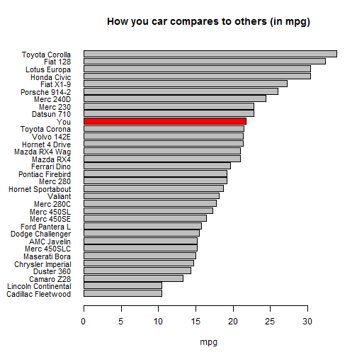

Developing Data Products Course Project
========================================================

## Fuel Cost Calculator

Chan Sing Eu

26 Apr 2015

INTRODUCTION
========================================================

This presentation is part of the Course Project for the Coursera Developing Data Products class. This presentation addresses the second part of the course project.

The app developed for the first part of the assignment is available at:
https://csingeu.shinyapps.io/Developing-Data-Products-Project/

Source code for ui.R and server.R files are available on the GitHub:
https://github.com/csingeu/Developing-Data-Products-Project

FUEL COST CALCULATOR
========================================================

This app aims to help you to calculate the estimated mpg of your car, based on your car's weight, number of cylinders and horsepower. It uses a linear regression model based on the mtcars dataset from R. With your estimated mpg, and your monthly work trip distance and petrol cost, it will compute for you your monthly and yearly petrol costs. It also gives an indication of your car's mileage ranking among the other cars in mtcars dataset. 

MTCARS DATASET
========================================================

The data used in the app comes from the Motor Trend Car Road Tests (mtcars) dataset. The data was extracted from the 1974 Motor Trend US magazine, and comprises fuel consumption and 10 aspects of automobile design and performance for 32 automobiles (1973-74 models).


```r
head(mtcars)
```

```
                   mpg cyl disp  hp drat    wt  qsec vs am gear carb
Mazda RX4         21.0   6  160 110 3.90 2.620 16.46  0  1    4    4
Mazda RX4 Wag     21.0   6  160 110 3.90 2.875 17.02  0  1    4    4
Datsun 710        22.8   4  108  93 3.85 2.320 18.61  1  1    4    1
Hornet 4 Drive    21.4   6  258 110 3.08 3.215 19.44  1  0    3    1
Hornet Sportabout 18.7   8  360 175 3.15 3.440 17.02  0  0    3    2
Valiant           18.1   6  225 105 2.76 3.460 20.22  1  0    3    1
```

In the app, we will estimate mpg using car weight, number of cylinders and horsepower.

HOW YOUR CAR COMPARES WITH OTHER CARS (IN MPG)
========================================================

 

